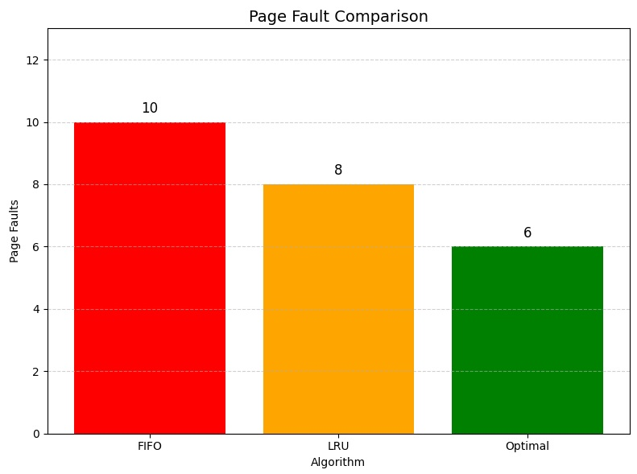
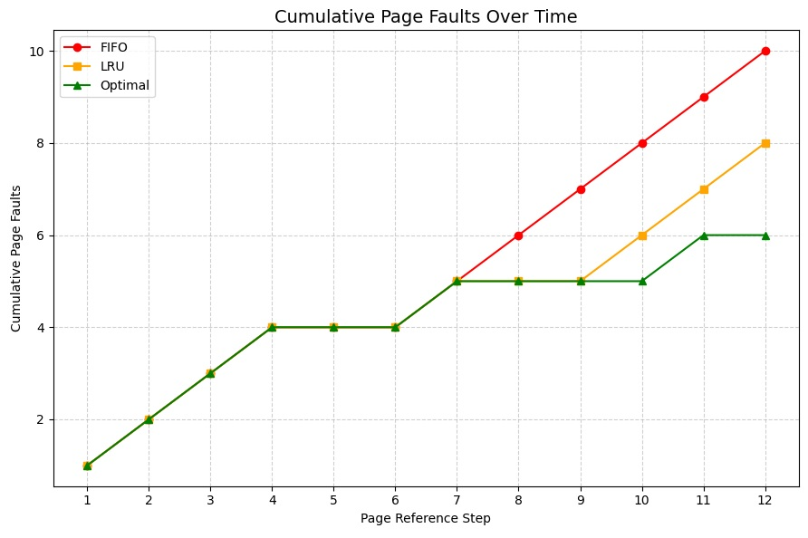

<div align="center">

# 🖥️ OS Memory Management Simulator

**A from-scratch simulation of core Operating System memory management techniques — page replacement algorithms (FIFO, LRU, Optimal), segmentation, and paged segmentation — with visual page-fault analysis.**

[](https://python.org)
[](https://matplotlib.org)
[](LICENSE)

[📂 Source Code](https://github.com/syedibrahimdev/OS-Memory-Management-Simulator) · [🐛 Report Bug](https://github.com/syedibrahimdev/OS-Memory-Management-Simulator/issues)

</div>

---

## 🧐 What Is This?

Operating Systems manage limited physical memory by swapping data in and out using **paging** and **segmentation** strategies. This project simulates the three classic page replacement algorithms taught in every OS course, plus memory segmentation models — built from scratch in pure Python, with matplotlib visualizations to compare algorithm efficiency.

---

## 📚 Algorithms Explained

### 1️⃣ FIFO (First-In-First-Out)
Evicts the **oldest page** in memory, regardless of how often it's used. Simple to implement (just a queue), but can perform poorly — it may evict a frequently-used page just because it arrived first. Suffers from **Belady's Anomaly**: adding more frames can sometimes *increase* page faults.

### 2️⃣ LRU (Least Recently Used)
Evicts the page that **hasn't been accessed for the longest time**. Based on the principle that recently used pages are more likely to be used again soon (temporal locality). More effective than FIFO in most real workloads, but requires tracking access timestamps for every page.

### 3️⃣ Optimal (Belady's Algorithm)
Evicts the page that **won't be used for the longest time in the future**. This is the theoretical best-case algorithm — it requires knowing the entire future reference sequence in advance, which is impossible in a real OS. Used only as a benchmark to measure how close FIFO/LRU come to ideal performance.

---

## 🖼️ Visual Output

**Page Fault Comparison (Total Faults per Algorithm)**


**Page Fault Trace (Cumulative Faults Over Time)**


The trace chart shows *how* faults accumulate step-by-step — Optimal consistently faults the least, while FIFO and LRU diverge based on access patterns.

---

## ✨ Features

| Feature | Description |
|---------|-------------|
| 🔄 FIFO Paging | Queue-based oldest-page eviction |
| 🕐 LRU Paging | Timestamp-based least-recently-used eviction |
| 🔮 Optimal Paging | Future-lookahead benchmark algorithm |
| 🧩 Segmentation | Simulates variable-size segment allocation with fragmentation tracking |
| 📐 Paged Segmentation | Hybrid model — segments broken into fixed-size pages mapped to frames |
| 📊 Bar Chart Comparison | Total page faults per algorithm, side-by-side |
| 📈 Fault Trace Line Chart | Cumulative faults over each reference step |
| 🖥️ Interactive CLI Menu | Run any simulation directly from terminal |

---

## 🏗️ Project Structure
OS-Memory-Management-Simulator/

│

├── Memory_Simulator.py         # Main entry point — unified CLI menu, all algorithms + graphs

├── paging_fifo.py              # Standalone FIFO reference implementation

├── paging_lru.py               # Standalone LRU reference implementation

├── paging_optimal.py           # Standalone Optimal reference implementation

├── paging_menu.py              # Standalone paging-only CLI (FIFO/LRU/Optimal)

├── segmentation_sim.py         # Pure segmentation simulation

├── paged_segmentation_sim.py   # Hybrid paged-segmentation simulation

│

├── images/

│   ├── page_fault_comparison.png

│   └── page_fault_trace.png

│

├── requirements.txt

└── README.md

---

## 🚀 Getting Started

```bash
# 1. Clone the repo
git clone https://github.com/syedibrahimdev/OS-Memory-Management-Simulator.git
cd OS-Memory-Management-Simulator

# 2. Install dependencies
pip install -r requirements.txt

# 3. Run the simulator
python Memory_Simulator.py
```

---

## 🖥️ How to Use

Run `Memory_Simulator.py` and choose from the menu:

=== Memory Management Simulator ===

1. Simulate Paging
2. Simulate Segmentation
3. Simulate Paged Segmentation
4. Graph Page Faults (Bar Comparison)
5. Graph Page Fault Trace (Over Time)
6. Exit

---

- **Option 1** → pick FIFO, LRU, or Optimal and see a step-by-step trace of hits/faults/evictions
- **Option 2** → simulate fixed-size segment allocation and external fragmentation
- **Option 3** → simulate segments split into pages mapped onto physical frames
- **Option 4** → bar chart comparing total faults across all 3 algorithms
- **Option 5** → line chart showing cumulative faults over the full reference string

---

## 🔧 Tech Stack

| Layer | Technology |
|-------|-----------|
| Language | Python 3.9+ |
| Visualization | Matplotlib |
| Core Concepts | Queues (deque), Hash Maps, Greedy Lookahead |

---

## 🗺️ Roadmap

- [x] FIFO, LRU, Optimal paging algorithms
- [x] Segmentation & paged segmentation simulation
- [x] Bar chart fault comparison
- [x] Cumulative fault trace visualization
- [ ] Add Second-Chance (Clock) algorithm
- [ ] Web-based interactive version (Streamlit)
- [ ] Configurable page reference input via CLI args

---

## 🤝 Contributing

Pull requests are welcome. For major changes, open an issue first to discuss what you'd like to change.

---

## 👨‍💻 Author

**Syed Ibrahim Ahmed**
[](https://github.com/syedibrahimdev)
[](https://www.linkedin.com/in/syed-ibrahim-ahmed-6aa304247/)

---

<div align="center">
  <sub>Built to understand how Operating Systems actually manage memory</sub>
</div>
